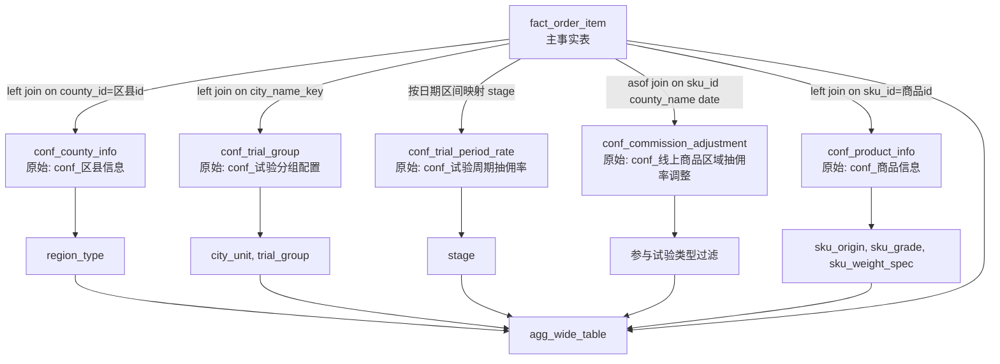

# cr_analyze 数据源关联图与处理流程图

本文基于当前代码实现梳理（`workers/cr_analyze/main.py`, `workers/cr_analyze/transformer.py`, `workers/cr_analyze/config.py`, `workers/cr_analyze/sql/order_fact_whole.sql`）。

目标：把你关心的内容说清楚：
- 主表是什么
- 关联了哪些表
- 关联条件是什么
- 过滤条件是什么
- 聚合口径是什么

## 1. 主表与最终产物

- 主表（事实明细）：`fact_order_item`（来自 `order_fact_whole.sql`）
- 最终核心结果表：`agg_wide_table`
- 其他结果表：
  - `trial_phase_config_wide`
  - `trial_phase_config_pivot`
  - `trial_sku_profile`

### 1.1 技术表名与原始多维表格表名映射

- `conf_product_info` -> 原始多维表格：`conf_商品信息`
- `conf_trial_product_info` -> 原始多维表格：`conf_试验商品信息`
- `conf_county_info` -> 原始多维表格：`conf_区县信息`
- `conf_commission_adjustment` -> 原始多维表格：`conf_线上商品区域抽佣率调整`
- `conf_trial_region_price` -> 原始多维表格：`conf_线上商品试验区域价格`
- `conf_trial_group` -> 原始多维表格：`conf_试验分组配置`
- `conf_trial_period_rate` -> 原始多维表格：`conf_试验周期抽佣率`

## 2. 数据源到结果的关联图（ER/血缘视角）

## 3. 处理流程图（执行顺序视角）

```mermaid
flowchart LR
  S1[抽取 Lark 7表] --> S2[执行 MC SQL<br/>生成 fact_order_item]
  S2 --> S3[字段重命名 FIELD_MAPPING]
  S3 --> S4[公共过滤<br/>is_valid=1 & sku_id in 3个SKU]
  S4 --> S5[关联区县信息<br/>补 region_type]
  S5 --> S6[关联试验分组<br/>补 city_unit/trial_group]
  S6 --> S7[按试验周期配置映射 stage]
  S7 --> S8[关联抽佣配置<br/>参与试验类型过滤]
  S8 --> S9[关联商品信息<br/>补产地/色号/包装]
  S9 --> S10[计算 stage_week/is_complete_week/trading_days]
  S10 --> S11[按阶段粒度聚合]
  S11 --> S12[计算 commission_rate/target_r0]
  S12 --> OUT[写入 agg_wide_table]
```

## 4. 关键关联说明（你重点关注）

### 4.1 主表

- 主表是 `fact_order_item`。
- 所有指标（`gmv`, `commission_amount`, `order_count`, `active_store_count` 等）都从它汇总。

### 4.2 各维表关联条件

1) `conf_county_info`（原始多维表格：`conf_区县信息`，补 `region_type`）
- Join: `fact.county_id = conf_county_info.区县id`
- 类型：left join

2) `conf_trial_group`（原始多维表格：`conf_试验分组配置`，补 `city_unit`, `trial_group`）
- 先构造城市 join key：
  - fact 侧：`normalize(市名称)`
  - 配置侧：`normalize(市名称)`，若空则 `normalize(区域名称)`
- Join: `city_join_key = join_key`
- 类型：left join
- 后置过滤：只保留 `trial_group` 非空（即试验城市）

3) `conf_trial_period_rate`（原始多维表格：`conf_试验周期抽佣率`，补 `stage`）
- 非标准 join，而是日期区间映射：
  - 若 `试验起始日期 <= 日期 <= 试验结束日期`，赋值对应 `试验阶段`
- 得到 `stage ∈ {归一化预备期, 摸底期, 生效期}`

4) `conf_commission_adjustment`（原始多维表格：`conf_线上商品区域抽佣率调整`，参与试验类型过滤）
- 关联键：`sku_id + county_name + 日期`
- 当前实现为 asof 双向兜底：
  - backward: 取 `<=交易日` 最近配置
  - forward: 若缺失再取 `>=交易日` 最近配置
- 过滤条件：
  - 包含“试验区域”
  - 且不包含“非试验区域”
- 这是影响总量收缩最明显的一步

5) `conf_product_info`（原始多维表格：`conf_商品信息`，补商品属性）
- Join: `sku_id = 商品id`
- 类型：left join
- 输出：`sku_origin`, `sku_grade`, `sku_weight_spec`

## 5. 公共过滤与核心口径

### 5.1 公共过滤

在 `compute_wide_table` 早期执行：
- `is_valid == 1`
- `sku_id in [10184690, 20519020, 20588413]`

### 5.2 参与试验类型过滤

在关联 `conf_commission_adjustment` 后执行：
- `is_trial_region(value) == True`
- 逻辑：文本含“试验区域”且不含“非”

### 5.3 阶段粒度聚合

`_aggregate_by_stage` 中：
- 归一化预备期：`stage × 日期 × city_unit × region_type`
- 摸底期：`stage × city_unit × sku_id × region_type × trial_group`
- 生效期：`stage × stage_week × city_unit × sku_id × region_type × trial_group`

### 5.4 指标聚合规则

- `order_count = nunique(order_item_id)`
- `active_store_count = nunique(store_id)`
- `gmv = sum(gmv)`
- `commission_amount = sum(commission_amount)`
- `stockout_num = sum(max(ordered_num-delivered_num, 0))`
- `supply_price = mean(supply_price_per_jin)`
- `commission_rate = commission_amount / gmv`

## 6. trading_days / stage_week 计算逻辑

在 `_compute_stage_week`：

1) 生效期
- `stage_week = 生效期_W{N}`，从生效期开始日按 7 天滚动
- `is_complete_week = 该周唯一日期数 >= 7`
- `trading_days = 该周唯一日期数`

2) 摸底期
- `trading_days = 摸底期唯一日期数 - 端午节日期(2026-06-19~2026-06-21)`

3) 归一化预备期
- `trading_days = 1`（日粒度）

## 7. 为什么你会感觉“总量偏小”

从当前代码设计看，主要不是图表再次计算，而是口径差异：
- 宽表一定会经过“参与试验类型过滤”
- 如果某些日期在配置里被标为“非试验区域”，即使明细有交易，也会被过滤掉
- 因此“纯明细直算”与“宽表总量”天然可能差很多

## 8. 可核对清单（你看图后可按这个逐条确认）

1) 主表是否是 `fact_order_item`
2) 参与试验类型过滤是否应该作用于 Tab4
3) `conf_commission_adjustment` 的日期与类型变化是否符合业务预期
4) 摸底期 `trading_days` 是否应扣端午（当前实现会扣）
5) Tab4 是展示“试验口径”还是“全量口径”

如果你确认需要，我可以下一步再补一版“按你业务定义”的双口径图（试验口径 vs 全量口径）并标注会影响哪些 tab 与指标。
